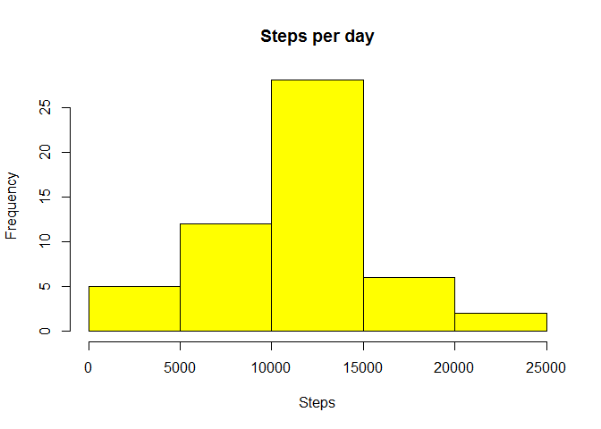
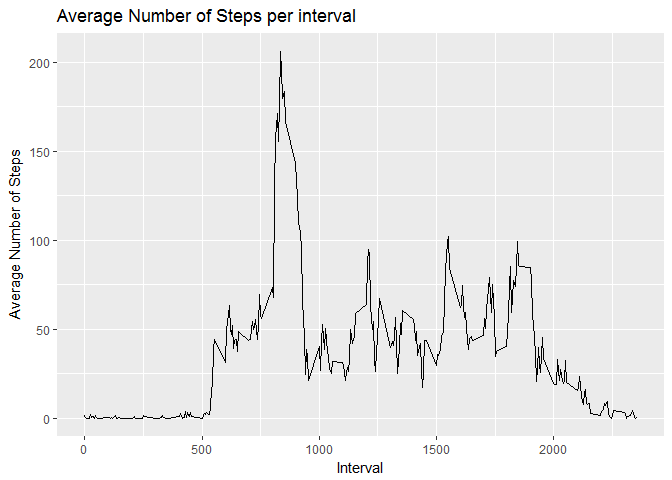
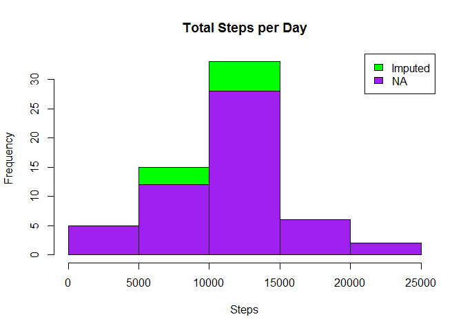
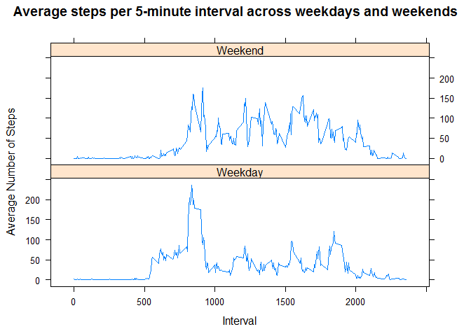

# Reproducible Research: Peer Assessment 1
## Loading and preprocessing the data
###Load required packages

```r
	library(knitr)
  library(plyr)
```

###Set the default of echo throughout the document

```r
	opts_chunk$set(echo = TRUE)
```
###Read and process the data

```r
	loadData <- function(dataURL="", destF="default.csv", method = NULL){
  		if(!file.exists(destF)){
           		temp <- tempfile()
            	download.file(dataURL, temp, method = method)
            	unzip(temp, destF)
            	unlink(temp)
        	}else{
            	message("Data already downloaded.")
        	}
		}

	dataURL <-"https://d396qusza40orc.cloudfront.net/repdata%2Fdata%2Factivity.zip"
	loadData(dataURL, "activity.csv")


	data <- read.csv("activity.csv", header = TRUE, sep = ',', colClasses = c("numeric", "character",
                                                                          "integer"))
	data$day <- weekdays(as.Date(data$date))
	data$DateTime<- as.POSIXct(data$date, format="%Y-%m-%d")
```
###Check the data

```r
	str(data)
```

```
## 'data.frame':	17568 obs. of  5 variables:
##  $ steps   : num  NA NA NA NA NA NA NA NA NA NA ...
##  $ date    : chr  "2012-10-01" "2012-10-01" "2012-10-01" "2012-10-01" ...
##  $ interval: int  0 5 10 15 20 25 30 35 40 45 ...
##  $ day     : chr  "Monday" "Monday" "Monday" "Monday" ...
##  $ DateTime: POSIXct, format: "2012-10-01" "2012-10-01" ...
```

```r
	head(data)
```

```
##   steps       date interval    day   DateTime
## 1    NA 2012-10-01        0 Monday 2012-10-01
## 2    NA 2012-10-01        5 Monday 2012-10-01
## 3    NA 2012-10-01       10 Monday 2012-10-01
## 4    NA 2012-10-01       15 Monday 2012-10-01
## 5    NA 2012-10-01       20 Monday 2012-10-01
## 6    NA 2012-10-01       25 Monday 2012-10-01
```

##What is mean total number of steps taken per day?

###Total steps per day

```r
	sumTable <- aggregate(data$steps ~ data$date, FUN=sum, )
	colnames(sumTable)<- c("Date", "Steps")
```
###Histogram showing total steps per day

```r
  hist(sumTable$Steps, breaks=5, xlab="Steps", main = "Steps per day", col="yellow")
```

<!-- -->

##What is the average daily activity pattern?

###Show the mean of steps

```r
	as.integer(mean(sumTable$Steps))
```

```
## [1] 10766
```
###Show the median of steps

```r
	as.integer(median(sumTable$Steps))
```

```
## [1] 10765
```

#Time series plot of the average number of steps taken
###Load required packages

```r
library(plyr)
library(ggplot2)
```
###Recall data and remove NAs

```r
	clean <- data[!is.na(data$steps),]
```
##Imputing missing values
###Generate average number of steps per interval

```r
	intervalTable <- ddply(clean, .(interval), summarize, Avg = mean(steps))
```
###Create a line plot showing the average number of steps per interval

```r
	p <- ggplot(intervalTable, aes(x=interval, y=Avg), xlab = "Interval", ylab="Average Number of Steps")
	p + geom_line()+xlab("Interval")+ylab("Average Number of Steps")+ggtitle("Average Number of Steps per interval")
```

<!-- -->

#The 5-minute interval that, on average, contains the maximum number of steps

###Find which interval has the highest average number of steps

```r
	maxSteps <- max(intervalTable$Avg)
	intervalTable[intervalTable$Avg==maxSteps,1]
```

```
## [1] 835
```

#Describe and show a strategy for imputing missing data

###Find the total number of NAs in the original data

```r
	nrow(data[is.na(data$steps),])
```

```
## [1] 2304
```
###Replace NAs using the average 5-minute interval

```r
	avgTable <- ddply(clean, .(interval, day), summarize, Avg = mean(steps))
	nadata<- data[is.na(data$steps),]
	newdata<-merge(nadata, avgTable, by=c("interval", "day"))
```
###Reorder the new substituted data in the same format as the clean data

```r
	newdata2<- newdata[,c(6,4,1,2,5)]
	colnames(newdata2)<- c("steps", "date", "interval", "day", "DateTime")
```
###Merge the NA averages and non NA data together

```r
	mergeData <- rbind(clean, newdata2)
```
###Create sum of steps per date for comparison

```r
	sumTable2 <- aggregate(mergeData$steps ~ mergeData$date, FUN=sum, )
	colnames(sumTable2)<- c("Date", "Steps")
```
###Mean of Steps without NAs

```r
	as.integer(mean(sumTable2$Steps))
```

```
## [1] 10821
```
###Median of Steps without NAs

```r
	as.integer(median(sumTable2$Steps))
```

```
## [1] 11015
```
#Histogram of the total number of steps taken each day after missing values are imputed

```r
	hist(sumTable2$Steps, breaks=5, xlab="Steps", main = "Total Steps per Day", col="green")
	hist(sumTable$Steps, breaks=5, xlab="Steps", main = "Total Steps per Day", col="purple", add=T)
	legend("topright", c("Imputed", "NA"), fill=c("green", "purple") )
```

<!-- -->

## Are there differences in activity patterns between weekdays and weekends?
###Load the required package

```r
library(lattice) 
```
###Create new category based on the days of the week

```r
	mergeData$DayCategory <- ifelse(mergeData$day %in% c("Saturday", "Sunday"), "Weekend", "Weekday")
```

###Summarize data by interval and type of day

```r
	intervalTable2 <- ddply(mergeData, .(interval, DayCategory), summarize, Avg = mean(steps))
```
###Plot data in a panel plot

```r
	xyplot(Avg~interval|DayCategory, data=intervalTable2, type="l",  layout = c(1,2),
	       main="Average steps per 5-minute interval across weekdays and weekends",
	       ylab="Average Number of Steps", xlab="Interval")
```

<!-- -->

